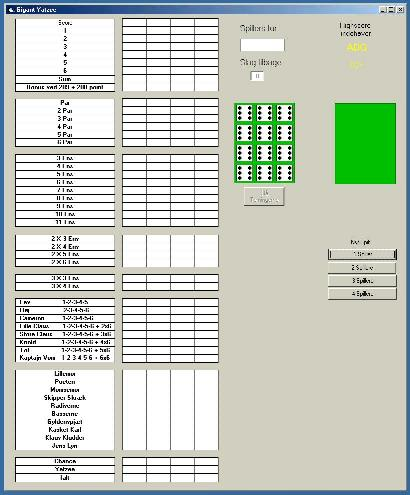



## Giant Yatzee

### Description

Here is Giant Yatzee, the yatzee game with 12 dices and everything else a Giant Yatzee needs...

I don't know if there exists a giant yatzee in other countries, and if it does I don't know if it's the same, but this is the danish version of Giant Yatzee...

I'm sorry I didn't translate it to english, but I guess it is not hard to figure out what they means

The Original Code comes from Knoton:

http://www.planet-source-code.com/xq/ASP/txtCodeId.24535/lngWId.1/qx/vb/scripts/ShowCode.htm

Have Fun
 
### More Info
 

             |
---                |---
**Submitted On**   |2001-07-31 15:20:54
**By**             |[ADG](https://github.com/Planet-Source-Code/PSCIndex/blob/master/ByAuthor/adg.md)
**Level**          |Beginner
**User Rating**    |3.5 (14 globes from 4 users)
**Compatibility**  |VB 6\.0
**Category**       |[Games](https://github.com/Planet-Source-Code/PSCIndex/blob/master/ByCategory/games__1-38.md)
**World**          |[Visual Basic](https://github.com/Planet-Source-Code/PSCIndex/blob/master/ByWorld/visual-basic.md)
**Archive File**   |[Giant Yatz238087312001\.zip](https://github.com/Planet-Source-Code/adg-giant-yatzee__1-25638/archive/master.zip)

